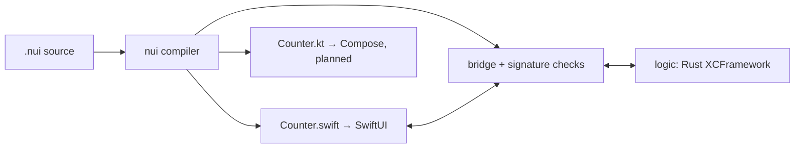

# nui

A language-agnostic UI framework for mobile. UI is written once in the `nui`
DSL and rendered **natively** on each platform — SwiftUI on iOS, Jetpack
Compose on Android. Business logic lives in whatever language you like
(Rust, Go, TypeScript, C++, …) behind a single message protocol.

```
component Counter {
    state count: Int = 0

    logic {
        fn increment(count: Int) -> Int
        fn decrement(count: Int) -> Int
    }

    VStack {
        spacing: 16
        style: { padding: 24 }

        Text {
            text: "Count: {count}"
            style: { font: title }
        }

        HStack {
            spacing: 12

            Button {
                label: "-"
                on_click: { count = decrement(count) }
            }
            Button {
                label: "+"
                on_click: { count = increment(count) }
            }
        }
    }
}
```

## Architecture

**nui owns the state; the backend owns the logic.** A `.nui` file declares
the state (owned and held by the generated UI), the typed interface of the
logic functions, and the view tree with actions that route a tap into a
logic call and assign the result back to state. The UI never computes
values; the logic layer (pure functions, no globals) never touches a view.

The compiler (this crate, Rust) lowers `.nui` source into a checked IR and
transpiles it to native source. No runtime ships with the app:



Three decisions worth knowing about:

- **IR-first.** The IR is the real contract; backends consume it, not the
  AST. Every language feature is checked once in the front end — actions are
  fully type-checked against the declared functions and state.
- **One source of truth.** From a single `.nui` file the compiler generates
  the SwiftUI file, the Swift↔Rust bridge, and Rust signature checks that
  fail the build on drift. The only handwritten code in the whole pipeline
  is the logic function bodies.
- **No CSS.** Styling is an inline `style: { ... }` block per view now,
  named styles and design tokens later — things that map 1:1 to both
  platforms. CSS's cascade, selectors, and box model don't.

## Try it

```sh
cargo run -- build examples/counter.nui --target swift   # SwiftUI to stdout
cargo run -- build examples/counter.nui -o CounterView.swift
cargo run -- build examples/counter.nui --target uikit \
    -o CounterViewController.swift                       # UIKit UI (experimental)
cargo run -- build examples/counter.nui --target rust \
    -o logic/counter/src/generated.rs                    # logic interface checks
cargo run -- build examples/counter.nui --target swift-bridge \
    -o logic/counter/swift/RustCounterLogic.swift        # UI↔logic adapter
cargo run -- build examples/counter.nui                  # IR JSON (debugging)
cargo run -- check examples/counter.nui                  # parse + check only
cargo test
```

The generated Swift file is self-contained (state struct, logic protocol,
`@Observable` store, view, preview) and typechecks against the iOS 17 SDK.
The corresponding Rust is just the function bodies:

```rust
#[uniffi::export]
pub fn counter_increment(count: i64) -> i64 {
    count.saturating_add(1)
}
```

Compile errors carry source positions, and actions are type-checked:

```
error: examples/counter.nui:26:38: `label` returns String but `count` is Int
```

## Repository layout

```
src/
  lexer.rs        tokenizer (strings lex straight into interpolation segments)
  parser.rs       recursive-descent parser → AST (ast.rs)
  lower.rs        checks + lowering: references, argument shapes, action types
  ir.rs           the checked IR — the contract all backends consume
  swift.rs        Swift backend: IR → a single drop-in SwiftUI file
  uikit.rs        UIKit backend (experimental): IR → view controller with
                  direct state application — no SwiftUI, no diffing
  rust_logic.rs   Rust backend: expected fn signatures + compile-time checks
  swift_bridge.rs bridge backend: UI protocol → UniFFI calls
  main.rs         CLI: nui build / nui check
docs/
  GRAMMAR.md  language reference: lexical rules, EBNF, views, semantics
examples/
  counter.nui the "hello world" — a counter whose logic lives elsewhere
  toggle.nui  `if` / `else` subtrees driven by a Bool state
  profile.nui record types: structured state, dotted paths, records
              passing whole through the Rust logic
logic/
  counter/    the counter's Rust logic: pure fns, UniFFI bindings,
              build-xcframework.sh, host-app files (see its README)
tests/
  counter.rs        compile the example, verify IR, JSON round-trip
  swift_codegen.rs  verify the emitted SwiftUI source
  logic_codegen.rs  verify the emitted Rust interface and Swift bridge
```

## Roadmap

- [x] IR design: view nodes, state schema, logic interface, text bindings
- [x] Compiler: lexer, parser, checker/lowering, `nui build` CLI
- [x] Swift backend: transpile IR → SwiftUI source (state, logic protocol,
      `@Observable` store with generated action methods, view, preview)
- [x] Logic model: nui owns the state, Rust owns the logic — typed
      `logic { fn ... }` interface, type-checked actions
      (`count = increment(count)`), UniFFI + XCFramework, running on the
      iOS simulator with a UI test proving taps flow through Rust
- [x] Generated everything: SwiftUI file, Swift↔Rust bridge, and Rust
      signature checks all come from the one `.nui` file; only the
      function bodies are handwritten
- [x] UIKit backend (experimental): the same IR transpiles to a pure
      UIKit view controller — native controls without SwiftUI, direct
      state application instead of diffing; same bridge, same UI tests
- [x] `if` / `else` conditionals driven by `Bool` state — a native `if`
      in SwiftUI, visibility-toggled branch containers in UIKit
      (`examples/toggle.nui`)
- [x] Record types: `type Person { ... }` as state, in logic signatures,
      and across the FFI boundary (UniFFI `Record` structs, prefixed to
      avoid symbol collisions; the bridge converts field-wise) — dotted
      paths in interpolation, arguments, and `if` conditions
      (`examples/profile.nui`)
- [ ] List types (`[Todo]`) and `for … in` — dynamic `List` content
- [ ] Kotlin backend: the same file shape for Jetpack Compose
- [ ] Language: component composition, navigation,
      named styles / design tokens
- [ ] Hot reload: interpret the IR JSON in a dev shell app
- [ ] More logic languages: Go, TypeScript (QuickJS/Hermes), C++
